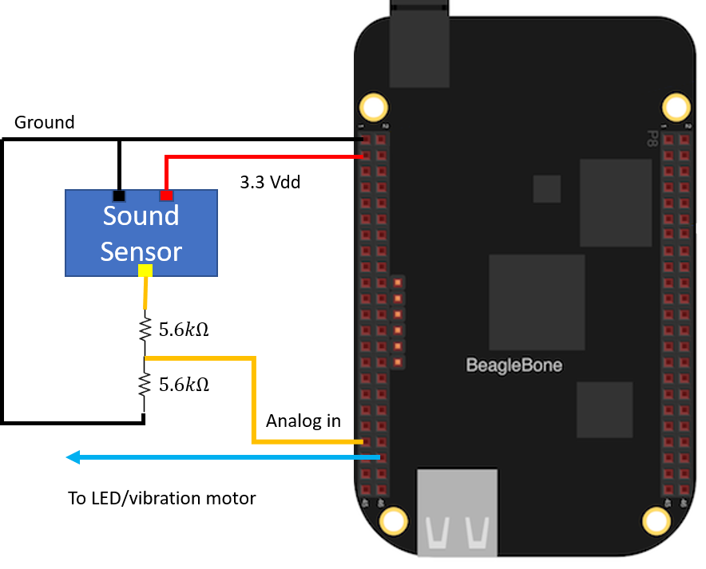

# Approaching Traffic Haptic Information System (ATHIS)

ATHIS is a prototype system for using audio signals to detect approaching vehicles.
It is intended for use by slow moving or pedestrian traffic. The system comprises
of a microphone, a Beaglebone Black kit, and a warning device.


To assemble the system you need:

* BeagleBone Black with Linux operating system with application pre-loaded
* 2x 5.6kΩ resistors
* Grove sound sensor (SKU 101020023)
* Grove vibration motor (SKU 105020003)
* Connector wires

Assemble the system like so:



Boot up the BeagleBone and log in to it using SSH. You will first need to enable analog pin functions. Execute the following command:

```
sudo echo BB-ADC > /sys/devices/platform/bone_capemgr/slots
```

Finally, run the application:

```
./ATHIS
```

The vibration motor should start buzzing when the sound sensor picks up the noise of an incoming vehicle. To quit the application, press Ctrl+C.


## Disclaimer
This application is a prototype. Do not use this while operating a vehicle.
See technical documentation for more details.
